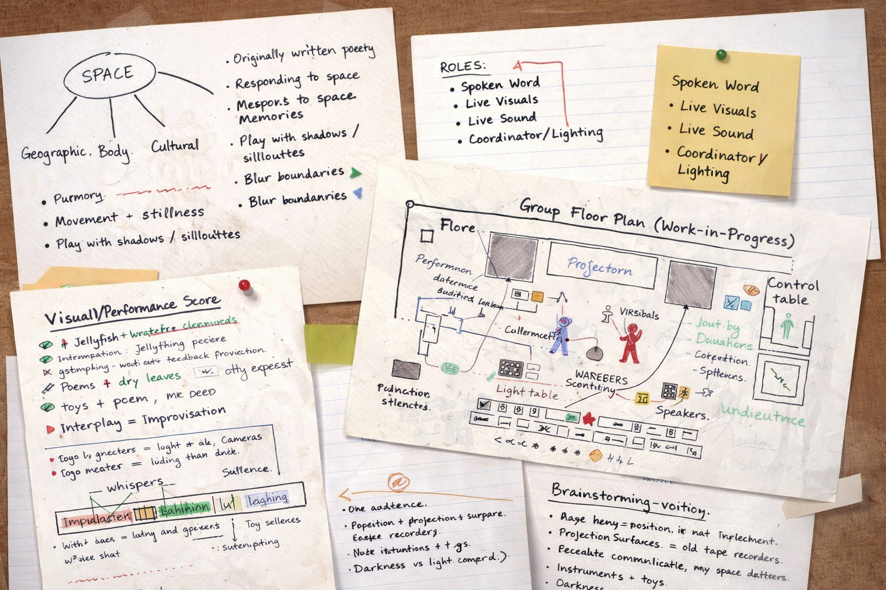
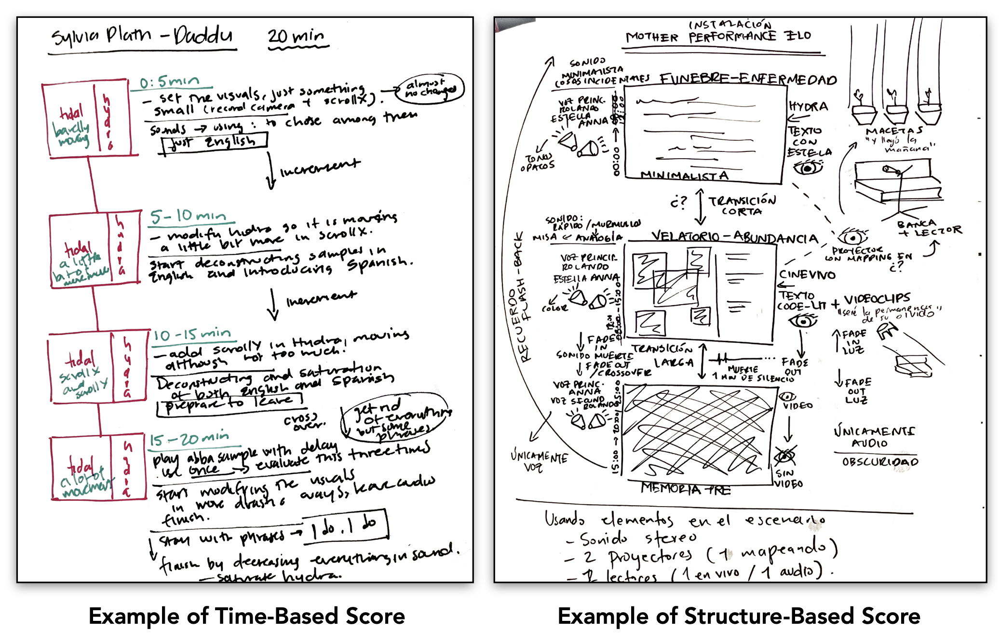

[← MEDIAART 3I03](README.md) | [Project 1 Overview](p1AutoDoc.md)

---

<h1 style="color: darkred;">P1 – In-Class Work II</h1>  

---

### Collective Brainstorming · Scoring · Roles & Spatial Planning  

This class-work session marks the **official beginning of Project 2**.

The focus of Class Work IV is to **form groups**, **define creative roles**, and **collectively plan** your live performative storytelling piece. This is a **conceptual and organizational session**, not a rehearsal or technical run.

By the end of this class, each group must have:
- a shared concept
- clearly defined roles
- a **work-in-progress floor plan**
- a **work-in-progress visual / performance score**

These materials will guide your **technical meetings in Class Work V** and your rehearsals.

---

<h2 style="color: darkred;">Group Formation & Required Roles</h2>

Project 2 is a **group-based performance** of **4–5 students per group**.  
Each group must include **at minimum** the following roles:

- **Spoken Word / Performer**
  - Live voice presence (spoken word, poetry, singing, improvisation, or other vocal performance)

- **Live Sound**
  - Sound generated live using instruments, objects, toys, recorders through microphones.  

- **Live Visuals**
  - Live visuals using the **light table with a live camera feed**, with the option to use a **small projection** and move between the light table and projection surface in real time.  

- **Coordinator / Lighting & Space**
  - Oversees spatial layout  
  - Runs lighting cues and checks sound levels live  
  - Coordinates transitions between elements

> Each **student must take only one role**.  
> Responsibilities must be clearly defined and **evenly distributed**.

### Optional / Expanded Roles

Groups may also choose to include:
- dancers or movers
- additional performer roles
- collaborators outside the class *(talk to the instructor first)*

---

## Live Performance Constraints (Reminder)

Before planning, **review the project restrictions**:

- **All sound must be live**
- **All visuals must be live**
- No pre-rendered or pre-recorded video
  *(unless sound is played and **actively manipulated live**)*
- No fixed soundtracks  
  *(unless sound is played and **actively manipulated live**)*
- The performance must respond to **space, audience, and duration**
- **Duration:** 8–10 minutes

The spoken word component may include:
- reading poetry or text
- improvisation
- singing
- hybrid or experimental vocal approaches

---

## What the Instructor Provides

For this project, the instructor will provide:
- Light table
- Live cameras
- Microphones
- Recorders
- General props (chairs, tables, etc.)

### What You Must Bring / Source

Each group is responsible for bringing:
- physical materials for visuals  
  (paper, transparencies, drawings, objects, textures)
- instruments, toys, recorders, or sound objects
- any additional props, costumes, or any other materials required for performance

---

<h2 style="color: darkred;"> Brainstorming & Planning (≈ 60 minutes) </h2>

### 1. Collective Brainstorming

As a group, discuss:
- the core idea or atmosphere of the performance
- themes, emotions, or narratives
- how sound, visuals, voice, and space interact

**The shared theme for this project is *Space*.**  
Reflect collectively on what *space* can mean, such as:
- geographical space
- the body as space
- cultural or social space
- imagined or abstract space

---

### 2. Role Definition

Each group must clearly assign:
- who is responsible for each role
- how roles interact during the performance
- how cues or transitions will be coordinated

Each student must begin drafting **their individual approach** so they arrive prepared for Class Work V.

---

### 3. Floor Plan (Work-in-Progress)

Using the **architectural ground plan** provided by the instructor, draft a floor plan that considers the position of all elements and performers within the performance area.

Consider the fixed positions of:
- audience
- projection surfaces
- light table
- speakers
- control table (lighting and sound)

This plan may change later — it is a **planning tool**, not a final diagram.

---

### 4. Visual / Performance Score (Work-in-Progress)

Create a **visual or temporal score** that maps:
- time
- actions
- sound events
- visual changes
- spoken word moments

This can be:
- drawn
- diagrammatic
- text-based
- symbolic

The goal is to **communicate structure**, not perfection.

Examples:  

---

<h2 style="color: darkred;"> 📤 Required Upload — Class Work IV  </h2>
**Due after class**

Each group must upload **one shared PDF** containing:

1. **Group Brainstorm Document**
   - Short description of the performance concept
2. **Division of Roles**
   - List of group members and assigned responsibilities
3. **Work-in-Progress Floor Plan**
   - Annotated diagram (hand-drawn or digital)
4. **Work-in-Progress Visual / Performance Score**
   - Any format that clearly communicates structure and timing

**File format:** PDF  
**File name:** `GroupName-P2-Planning.pdf`

---

## Grading & Expectations (Maintenance-Based System)

To maintain your grade for **Class Work IV**, you are expected to:
- participate actively in group formation and planning
- contribute ideas and planning materials
- complete and upload the required planning document on time

This session is **foundational**.  
Lack of preparation here will affect **Class Work V, rehearsals, and the final performance**, and may signal a **break in maintenance**.

---

<h2 style="color: darkred;">After Class Work IV (Important)</h2>

Before **Class Work V — Technical Meetings**, each student must:
- review their assigned role
- bring notes, sketches, question, or ideas specific to:
  - sound
  - visuals
  - lighting
  - performance
- be ready to discuss **concrete technical needs** with technicians

Additionally, begin to:
- defin your role-specific ideas
- gather source materials you will need
- review the live sound and live visual restrictions

[Class Work V](P2-InClassWork-V.md) will focus on **technical feasibility**, not conceptual brainstorming. Be open to work with the possibilities and restrictions of the space and available equipment.  

---
