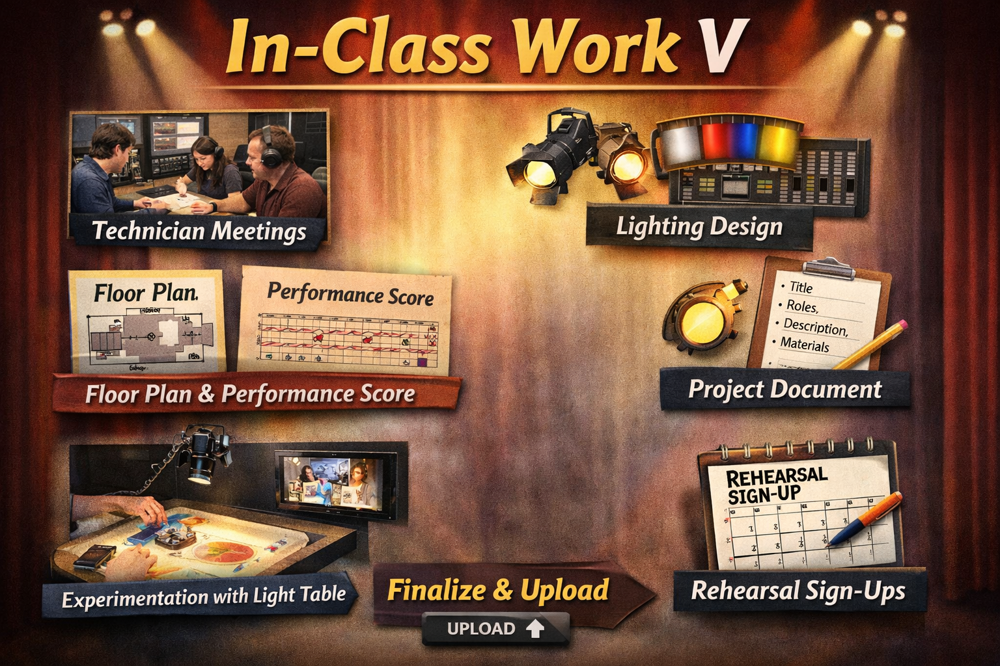
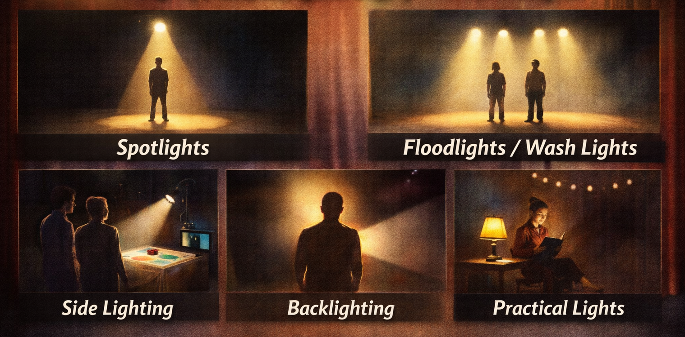

[← MEDIAART 3I03](README.md) | [Project 2 Overview](p2PerfStory.md)

---

<h1 style="color: darkred;">P1 – In-Class Work V</h1>  

---

### Technical Meetings · Spatial Finalization · Performance Lock-In  
*(Production Planning Session)*

Class Work V is a **critical production session** where all groups move from planning to **technical definition**.

This session focuses on:
- meeting with technicians
- finalizing spatial, lighting, sound, and visual decisions
- locking in a **workable version** of the performance plan

By the end of this class, your project should be **technically coherent and feasible**.

> This is the week where decisions are **defined and stabilized**.  
> Minor adjustments may happen later during rehearsals, but **no major conceptual or structural changes** should occur after this point.

---

## Fixed Technical Constraints

The following elements are **predefined and unmovable**:

- The **light table** location
- Microphone positions for live sound
- The **control booth**, located on the **opposite side of the performance area**

The **Coordinator / Lighting & Space** role is responsible for:
- overseeing the performance flow
- monitoring lighting cues
- ensuring all elements remain coordinated

Lighting will function as a **primary cueing system** for performers.  
Everyone in the group must understand and follow lighting cues.

---

## Sound & Instrumentation Constraints

- You **cannot use the piano** located in the space
- If using instruments, **you must bring them**
- Any instruments, objects, or sound devices must be:
  - listed clearly
  - communicated to the instructor and technicians

This allows for discussion of:
- amplification needs
- microphone types
- feedback risks
- spatial feasibility

---

## Lighting Design

Each group must define a **lighting plan**, including:
- type and position
- colour(s) and intensity
- cue points (based on time) and any motion or transitions

Lighting is not decorative — it must:
- support structure
- cue performers
- help coordinate live actions across the space

---

## Light Table Exploration (Optional but Strongly Recommended)

A **smaller light table** will be available during this session **specifically for students responsible for live visuals**.

- A **sign-up sheet** will be provided
- Each group may reserve **one 20-minute exploration slot**
- This time is intended for:
  - testing materials
  - experimenting with layering, movement, and textures
  - understanding scale, visibility, and camera response

This exploration period is **not a rehearsal**.  
It is a focused opportunity to:
- refine visual ideas
- identify material limitations
- prepare concrete questions for technicians and rehearsals

> ⚠️ **Important:**  
> Because access time is limited, students responsible for live visuals must arrive prepared with **materials they intend to test**.

Insights gained during this exploration should inform:
- your **performance score**
- your **lighting plan**
- your **technical decisions**

---

<h2 style="color: darkred;">Continued Planning & Refinement (When Not in Meetings)</h2>

When not meeting with technicians, groups must continue refining:

### 1. Floor Plan (Near-Final Version)
- Incorporate technician feedback
- Respect fixed equipment locations
- Clearly show position of performers (including the moving range).

### 2. Performance / Visual Score (Near-Final Version)

Your score must now include **minimum duration breakdowns**, such as:
- opening section (approx. time)
- middle section(s)
- ending section

The score should clearly communicate:
- timing
- cues
- transitions
- performer actions
- relationships between sound, visuals, voice, and lighting

---

<h2 style="color: darkred;"> 📤 Required Upload — Class Work V  </h2>
**Due after class**

Each group must prepare a **Project Document** that consolidates all decisions.

This document must include:

1. **Tentative Project Title**
2. **List of Authors & Roles**
3. **Work-in-Progress Description** (1 paragraph)
4. **List of Materials / Elements**
   - instruments
   - objects
   - sound devices
   - visual materials
5. **Technical Needs & Constraints Summary**
   - acknowledgment of fixed equipment locations
   - list of instruments / objects being used
   - confirmation that no additional major changes are planned
6. **Floor Plan** (Near-Final Version)
7. **Performance / Visual Score** (Near-Final Version)

**File format:** PDF  
**File name:** `GroupName-P2-Project.pdf`

---

## Sign-Up for Instructor Rehearsals (Required)

Before leaving class, each group must:
- sign up for **at least one (1)** rehearsal with the instructor
- may sign up for **up to two (2)** rehearsals if desired
- link for sign-up sheet is available on Avenue To Learn

Rehearsals are **group-based** and focused on:
- structure
- pacing
- coordination
- live responsiveness

---

## Grading & Expectations (Maintenance-Based System)

To maintain your grade for **Class Work V**, you are expected to:
- attend and participate in the technical meeting
- come prepared with concrete decisions
- complete and upload all required materials on time
- respect technical constraints and collective planning

Failure to define technical needs, roles, or structure at this stage may signal a **break in maintenance** and will impact rehearsals and performance quality.

---

<h2 style="color: darkred;">After Class Work V (Important)</h2>

Before the [**Group Rehearsals**](P2-GroupRehearsal.md), you are expected to:
- gather all required materials
- review cues and role responsibilities
- arrive rehearsal-ready
- read the instructions for the Group Rehearsal activity to understand expectations

From this point forward, the project should move toward **execution and refinement**, not redesign.

---

