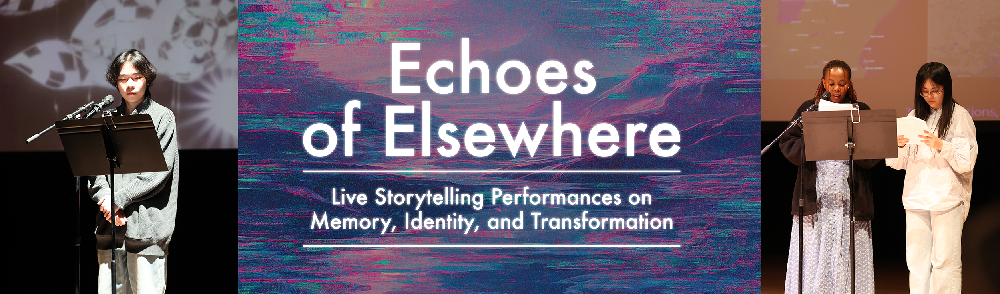

[← MEDIAART 3I03](README.md) | [Project 2 Overview](p2PerfStory.md)

---

<h1 style="color: darkred;">Open Performance — Public Concert Presentation</h1>  

<figure style="width: 100%; margin: auto;">
  
  <figcaption style="text-align: center; font-style: italic; margin-top: 0.5em;">
    Class Concert Winter 2025
  </figcaption>
</figure>

The **Open Performance** is the final public presentation of your performative storytelling project.  
This concert marks the culmination of weeks of planning, technical coordination, rehearsal, and refinement.

The event should be approached as a **professional live performance**, with care for timing, space, audience, and collective responsibility.

Specific details (date, time, location) will be communicated on **Avenue to Learn**.

---

<h2 style="color: darkred;"> Pre-Concert Rehearsal (Required) </h2>

Before the public concert, there will be a **Pre-Concert Rehearsal** held in the concert space.

This rehearsal will function as a **real-time run** of the entire concert, with:
- no long pauses
- no extended discussion
- full attention to timing and flow

### Pre-Concert Rehearsal Structure

- Groups will perform in the **same order** as the **Class Rehearsal + Critique Activity**
- Each group must arrive **ready to set up**
- This rehearsal will define:
  - the exact placement of all elements on and around the performance area
  - transitions between groups
  - pacing of the overall concert

⚠️ **Important:**  
No changes to structure, roles, or technical setup are permitted after this rehearsal.

---

<h2 style="color: darkred;"> Structure of the Concert </h2>

The public concert will follow this structure:

1. **Welcome & Introduction**
   - Brief introduction to the event
   - **Land Acknowledgement**

2. **Performances**
   - One person will introduce each group
   - The group performs their piece (8–10 minutes)

3. **Transitions**
   - After each performance, there will be **2–3 minutes** to:
     - remove materials
     - set up the next group
   - Groups must work efficiently and collaboratively during transitions

## Expectations for the Day of the Concert

### Arrival & Professional Conduct

- Students must arrive at the **required call time** communicated on Avenue
- All performers must be:
  - present
  - prepared
  - professional

All materials used in the performance must be brought to the **Pre-Concert Rehearsal** and will remain ready for the concert, which will take place **one or two days later** (preferably the following day).

### During the Concert

- While other groups are performing:
  - students must sit in the **designated audience area**
  - listen respectfully
  - avoid distractions (phones, side conversations, unrelated activities)

This is a public event.  
Your presence contributes to the atmosphere and professionalism of the concert.

## Documentation

The instructor will arrange for **professional documentation** of the concert, including:
- photography
- video
- sound recording

This documentation will be:
- shared with students after the concert
- used to support your **Final Submission**

Students do not need to document the concert themselves unless otherwise instructed.

## Audience & Public Invitation

The concert is **open to the public**.

Students are encouraged to:
- invite friends
- invite family
- share the event within their communities

This is an opportunity to present your work beyond the classroom.

---

<h2 style="color: darkred;"> Creative Production & Event Support (Required) </h2>

The **Open Performance** is a **collective production**, and all students are expected to contribute beyond their individual group performance.

This component emphasizes:
- professionalism
- collaboration
- care for shared resources
- respect for collective labor

### Production Roles

Each student will:
- be assigned (or volunteer for) a **specific production role**.
- work collaboratively with peers and the instructor
- complete their responsibilities **reliably and on time**

For this activity, production roles include:

- **Design & Visual Materials**  
  (posters, signage, digital assets)
- **Communications / Text Editing**
- **Technical Preparation**
- **Transportation**
- **Setup & Cleanup**
- **Concert Presenter**  
  (introducing the event and/or individual performances)

One student will be invited by the instructor to act as the **Student Coordinator**, helping manage communication, scheduling, and workflow across roles.

A **sign-up spreadsheet** for production roles will be available on **Avenue to Learn** early in the term.

## Grading & Expectations (Maintenance-Based System)

To maintain your grade for the **Open Performance**, you are expected to:
- attend and participate in the Pre-Concert Rehearsal
- arrive on time and prepared for the concert
- perform professionally and respectfully
- support peers by being present and attentive
- follow all setup, transition, and conduct expectations

Failure to meet these expectations may signal a **break in maintenance**, even if your performance is completed.

---

<h2 style="color: darkred;"> After the Open Performance (Important) </h2>

After the Open Performance, students must:
- review the concert documentation when shared
- carefully read the instructions for the [**Final Submission**](P2-FinalSubmission.md)
- prepare and submit all required materials according to the deadlines on Avenue to Learn

---
