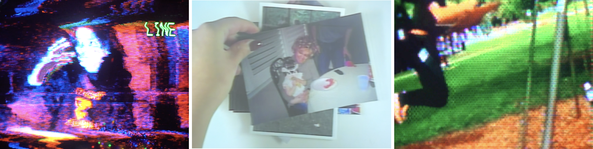
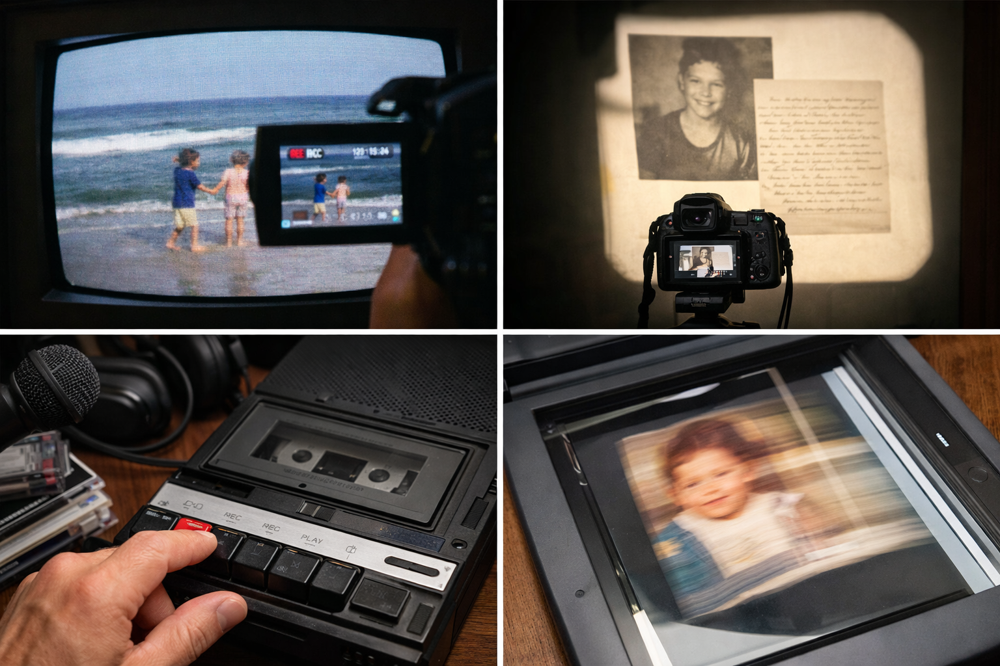

[MEDIAART 3I03](README.md)

-------------------------------------------------------------------------------

<h1 style="color: darkred;">Project 1 - Autobiographical Documentary</h1> 
*Individual Project*

<figure style="width: 100%; margin: auto;">
  
  <figcaption style="text-align: center; font-style: italic; margin-top: 0.5em;">
    Examples (Stills) by previous students.
  </figcaption>
</figure>

---

## Overview

In this project, you will create a **2–3 minute autobiographical documentary** that explores a personal story, memory, or theme connected to one or more layers of your identity.

The project is grounded in **auto-ethnographic research** and the use of **personal archival materials**, which must be **re-mediated through analogue media technologies** provided in class.

This project unfolds across **three structured class-work sessions**, each requiring a **mandatory upload** so the instructor can provide feedback and track your creative process.

---

## Index

+ [Class Work I](P1-InClassWork-I.md)
+ [Class Work II](P1-InClassWork-II.md)
+ [Class Work III](P1-InClassWork-III.md)
+ [Rough Cut Submission + Critique Activity](P1-RoughCut.md)
+ [Open Exhibition](P1-Exhibition.md)
+ [Final Submission](P1-Final.md)

---

## Analogue Media Technologies (Provided in Class)

You will work with some of the following tools:

- CRT TVs  
- Overhead projector  
- Cassette recorders  
- Scanners  

Examples of valid re-mediation include:
- Recording images or videos **off a CRT screen**
- Filming projections of photos, letters, or objects
- Recording narration or ambient sounds onto cassette, then re-recording
- Scanning photos or objects while moving them to create distortions

If you would like to test a different approach, discuss it with the instructor **before recording**.

---

## Conceptual Framework

As discussed in class and in *Rosas & Dittus (2019)*, autobiographical documentary involves re-contextualizing personal archives through **selection, montage, and mediation**.

Rather than presenting everything, you are asked to **curate, transform, and frame** your materials for an imagined audience.

Guiding questions:
- What do I want the audience to understand about me?
- How does analogue mediation change the meaning of my archive?
- What happens when memory passes through obsolete or imperfect technologies?

---
