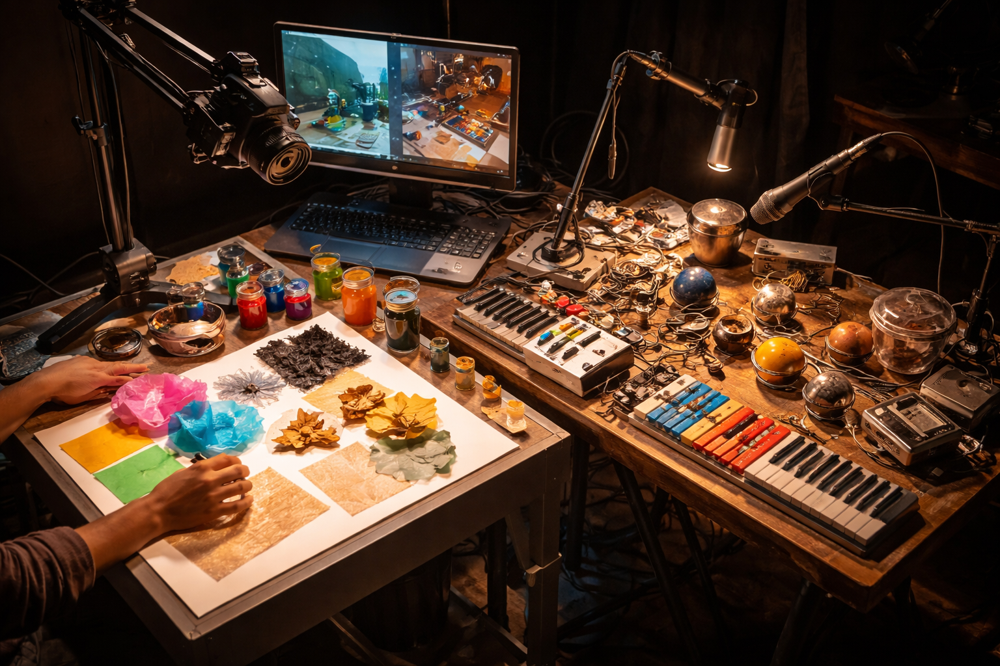

[MEDIAART 3I03](README.md)

-------------------------------------------------------------------------------

<h1 style="color: darkred;">Project 2 - Live Storytelling Performance</h1> 
*Group Project (4-5 students)*

<figure style="width: 100%; margin: auto;">
  
  <figcaption style="text-align: center; font-style: italic; margin-top: 0.5em;">
    Examples (Photo-Documentation of Performances) by previous students.
  </figcaption>
</figure>

---

## Overview

Project 2 is a **collective, performance-based project** that explores storytelling through **live sound, live visuals, light, space, and embodied presence**.

Working in groups, students will develop a **performative work presented in a public concert format**. The project emphasizes **collaboration, rehearsal, technical coordination, and responsiveness to space and audience**, rather than pre-rendered or fixed media.

The shared thematic focus for this project is **Space**.  
Students are invited to reflect on space as a concept and experience—such as physical space, architectural space, the body as space, cultural or social space, imagined space, or space as relation and movement—and to explore how these ideas can be expressed through live performance.

A key constraint of this project is that **both sound and visuals must be generated live**, using **analogue or physical processes** mediated through cameras, microphones, and simple digital mixing tools.

---

## Index

+ [Class Work IV — Collective Brainstorming, Scoring & Planning](P2-InClassWork-IV.md)
+ [Class Work V — One-to-One Technical Meetings (Sound · Projection · Lighting)](P2-InClassWork-V.md)
+ [Group Rehearsal — Instructor-Guided Session](P2-GroupRehearsal.md)
+ [Class Rehearsal + Critique Activity](P2-ClassRehearsal-Critique.md)
+ [Pre-Concert Rehearsal & Open Performance — Public Concert Presentation](P2-OpenPerformance.md)
+ [Final Submission — Project 2 Documentation Package](P2-FinalSubmission.md)

---

## Live Visuals — Technical Framework

All visual elements in Project 2 must be produced **live** during the performance.

Visuals will be generated using:
- A **light table** with a **live camera feed**
- Physical materials placed, moved, layered, or manipulated on the light table  
  (e.g. paper, transparencies, drawings, found objects, textures)
- **Optional:** a small projection on the floor or table, using the **same live camera feed** to switch between the light table and the projection surface

> Pre-recorded videos or pre-rendered animations are **not permitted**,  
> **unless** they are played and **actively altered live** through the optional setup.  
> Visual storytelling must rely on **improvisation, material exploration, and live manipulation**.

## Live Sound — Technical Framework

All sound must be produced **live** during the performance.

Groups may use:
- Musical instruments
- Old toys or mechanical objects
- Found objects and physical materials
- Cassette players or other analogue playback devices
- Voice (spoken, whispered, or performed)

Sound will be captured using **microphones**.

Audio will be mixed live and should respond to:
- the visuals
- the performers
- the space
- the unfolding structure of the performance

> Pre-recorded soundtracks or fixed compositions are **not permitted**,  
> **unless** they are played and **actively altered live** through cassette players or other analogue playback devices.  
> Sound should be treated as a **performative and responsive element**, not background.

---

## Notes

- Project 2 prioritizes **liveness, material exploration, and collective coordination**.
- All groups must work within the **shared technical framework** provided.
- Detailed technical instructions, schedules, and rehearsal logistics are available above in the Index section.
- This project follows the course’s **maintenance-based grading system**, with expectations outlined in each activity section.

---

