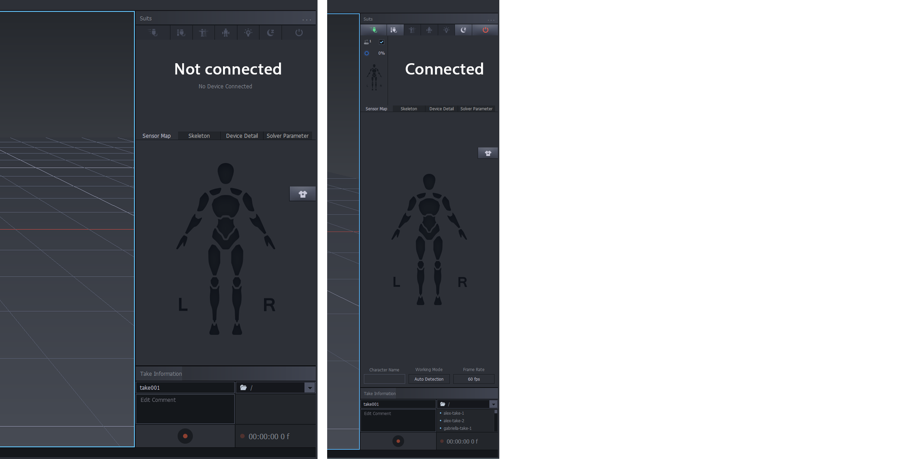
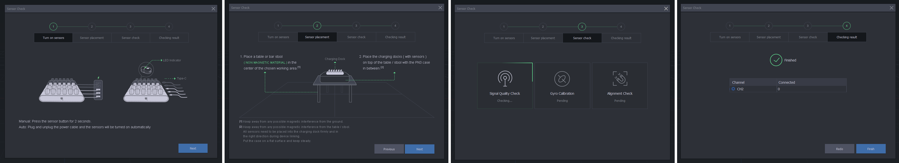
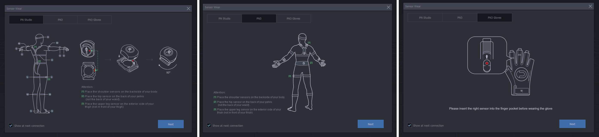

[MOCAP Tutorials](README.md) | [Home](../../README.md)

-------------------------------------------------------------------------------

# ⚙️ PN3 QuickStart Guide  
## Perception Neuron 3 (PN3) – General Setup & Sensor Initialization in Axis Studio

---

## 🧰 What You’ll Need:
- Fully charged **PN3 sensors** and **hub**
- PN3 **suit or straps**
- **Axis Studio** installed on your computer
- USB **receiver plugged into your computer**
- **3×3 meter workspace** (minimum) free of obstacles and metal interference

<iframe width="560" height="315" src="https://www.youtube.com/embed/MgAUYQAoXyk?si=TJ8aVa9u7bq6OLuC" title="YouTube video player" frameborder="0" allow="accelerometer; autoplay; clipboard-write; encrypted-media; gyroscope; picture-in-picture; web-share" referrerpolicy="strict-origin-when-cross-origin" allowfullscreen></iframe>

---

## Step 1: Check Everything is Connected

> In **Axis Studio**, go to the **Capturing** tab → **Sensor Check** panel.  
> Make sure the device shows as **Connected** and all sensors are online.

## Step 2: Sensor Check

> **Axis Studio → Capturing Tab → Sensor Check** Panel  
> Follow the on-screen instructions

### 🔌 Turn On Sensors
Choose one method, then click **Next**:
- **Manual**: Hold the power button on the hub for 2 seconds  
- **Auto**: Unplug and reconnect the USB-C power cable to auto-start sensors

### 🪑 Sensor Placement
- Place sensors **on the charging dock** on a **non-magnetic table or stool**
- Avoid magnetic surfaces or devices (metal desks, speakers, etc.)
- Click **Next**

### ✅ Sensor Check
The system will automatically run the following diagnostics:
- **Signal Quality Check** – verifies stable wireless connection  
- **Gyro Calibration** – aligns the sensors' internal orientation tracking  
- **Alignment Check** – ensures correct placement and positioning of sensors

### ✔️ Checking Result
- All sensors must show as **Connected**
- Click **Finish**

### Tutorial

<iframe width="560" height="315" src="https://www.youtube.com/embed/8yB58PIHUVw?si=XxTpHW7UXU7YPR9a" title="YouTube video player" frameborder="0" allow="accelerometer; autoplay; clipboard-write; encrypted-media; gyroscope; picture-in-picture; web-share" referrerpolicy="strict-origin-when-cross-origin" allowfullscreen></iframe>

---

## 🧍 Step 3: Wear the Sensors

### 🟢 Proper Sensor Placement  
> Use the [PN Studio] tab in Axis Studio for reference.

Key sensor locations:
- **[1] Shoulders** – Attach to the **upper back** of each shoulder  
- **[2] Hip** – Place firmly on the **back of your pelvis**, not lower back  
- **[3] Upper Legs** – Attach on the **outside of each thigh**, not the front  
- **Feet, arms, and wrists** – Follow strap guides for symmetrical placement

### 🧠 How Sensors Work
Each PN3 sensor uses an **inertial measurement unit (IMU)** to track movement through acceleration, rotation, and orientation.  
The hub **receives data wirelessly** from each sensor and streams it to Axis Studio in real time for live motion tracking.

---

## Step 4: Posture Calibration

Follow the instructions in [🧍‍♂️ Posture Calibration in Axis Studio](2_Body_Callibration.md) to complete body alignment before recording.

---

