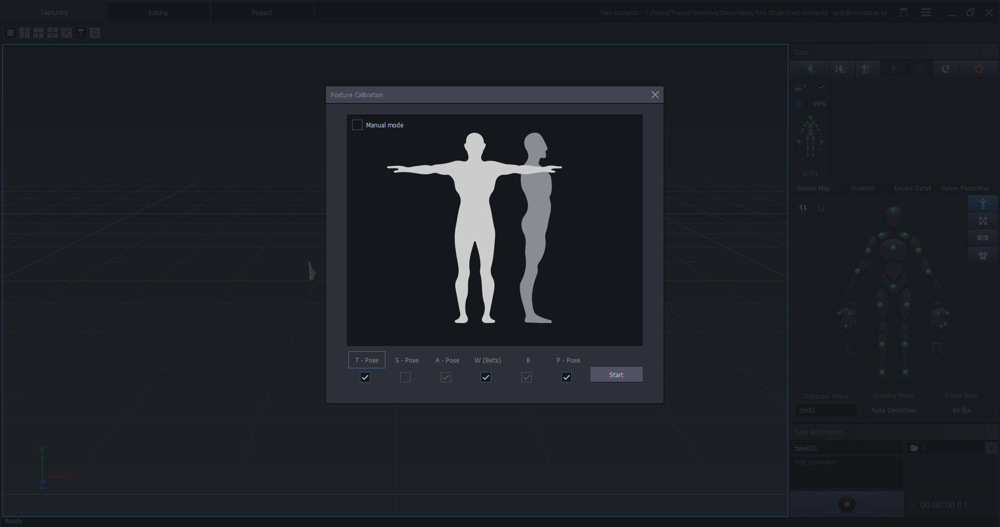

[Blender Tutorials](README.md) | [Home](../../README.md)

-------------------------------------------------------------------------------

# 🧍🧍‍♂️ Perception Neuron 3 (PN3) – Posture Calibration in Axis Studio

---

## 🔍 What is Body Calibration?

**Body calibration** is the process of aligning the motion capture system with the user’s physical body to ensure accurate tracking. During calibration, the software creates a digital skeleton that matches the performer’s proportions and posture, enabling clean motion data. It’s a crucial first step before recording or streaming mocap data.

---

## 🛠️ Setup & Calibration Steps in Axis Studio

### Before You Begin
- Ensure all **sensors are charged**, paired, and properly attached to the **PN3 suit/straps**.
- Connect the **Hub** via USB and confirm it’s recognized by the computer.
- Launch **Axis Studio** and verify that your **Perception Neuron 3 profile** is loaded.

---

### 1.  Launch & Connect
- Open **Axis Studio**.
- Go to the **Device** tab.
- Confirm the **Hub** and **all sensors (18 for PN3 full-body)** are online (green lights).
- Click **Connect** if not already connected.

---

### 2. Enter Posture Calibration
- Click on the T-Pose Human Icon on the right panel.
- Enable **T-Pose**, **W (Beta)**, and **P-Pose**.
- Click **Start**.

---

### 2. Enter Neutral T-Pose
- Stand upright with **feet shoulder-width apart**.
- Extend arms out horizontally to the sides (like a T).
- Keep head forward, knees slightly relaxed, and hands flat.
- Stand still during the process.

---

### 3. 🎯 Start Calibration
- In Axis Studio, navigate to the **Calibration Panel**.
- Select **Body Calibration** or **T-pose Calibration**.
- Click **Start Calibration**.

> ⏱️ The calibration will run for a few seconds. Avoid movement during this step.

---

### 4. ✅ Confirm Calibration
- Once finished, Axis Studio will show a **success notification**.
- You’ll see the virtual avatar match your body posture in real time.
- If the avatar looks distorted or offset, **repeat the calibration** or adjust sensor positions.

---

### 5. 🧪 Test Motion
- Walk around or perform a few simple gestures.
- Confirm that movements are tracking smoothly and accurately.

---

## 📝 Tips
- **Recalibrate** anytime sensors are moved or tracking appears off.
- Use **tight straps** and correct **sensor placement** for best results.
- If you're using multiple users, calibrate for **each individual body**.

---

