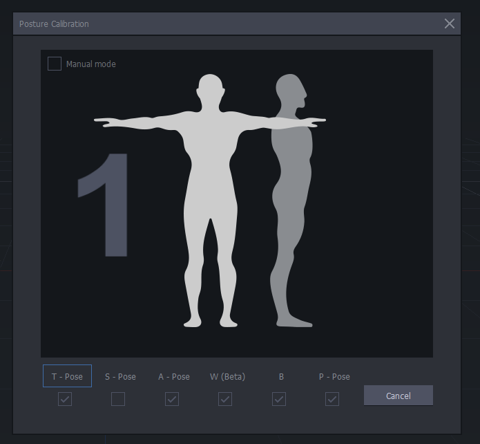
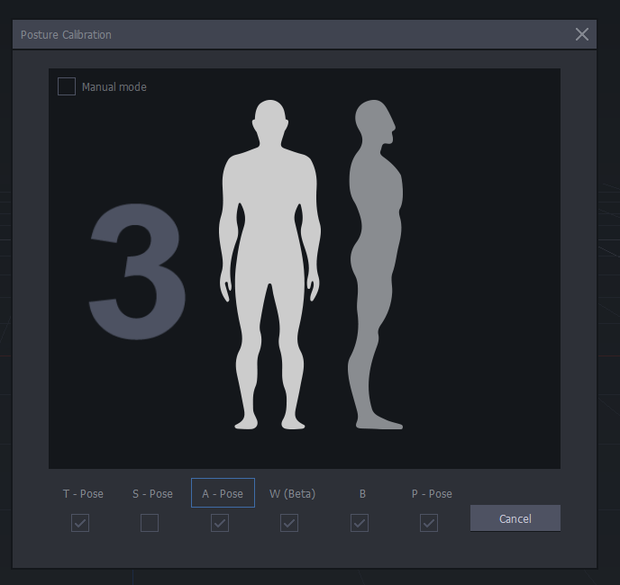
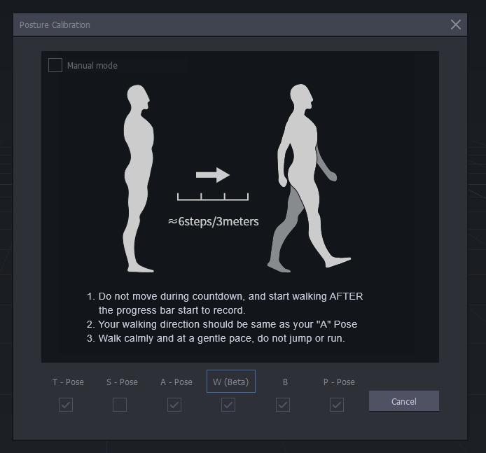
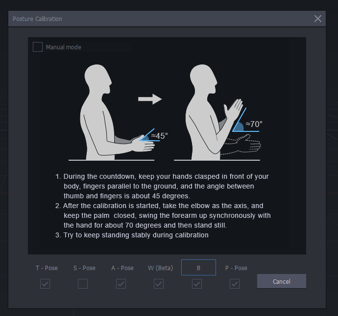
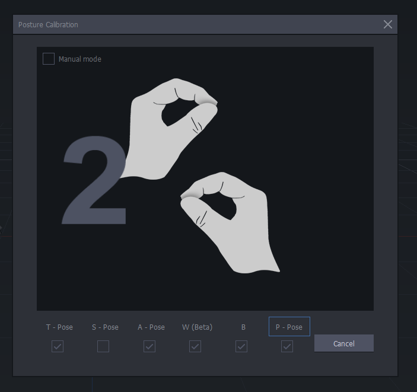

[Blender Tutorials](README.md) | [Home](../../README.md)

-------------------------------------------------------------------------------

# 🧍‍♂️ / 🧍‍♀️ Posture Calibration in Axis Studio

---

## 🤔 What is Body Calibration?

**Body calibration** is the process of aligning the motion capture system with the performer’s body to ensure accurate tracking. It creates a digital skeleton that reflects individual body proportions and neutral posture. Accurate calibration is essential for reliable movement capture and clean animation data.

---

## 🛠️ Setup & Calibration Steps in Axis Studio

### Before You Begin
- Ensure all **sensors are charged**, paired, and properly attached to the **PN3 straps or suit**.
- Connect the **Hub** via USB and confirm it’s recognized by your computer.
- Launch **Axis Studio** and verify that your **Perception Neuron 3 profile** is active.

---

### 1. Launch & Connect
- Open **Axis Studio**.
- Go to the **Device** tab.
- Confirm that the **Hub** and **all sensors (typically 18)** show green status.
- Click **Connect** if not already connected.

---

### 2. Enter Posture Calibration
- Click the **T-Pose icon** on the right-side toolbar to open the Posture Calibration panel.
- Enable the relevant posture types: **T-Pose**, **W (Beta)**, and **P-Pose**.

---

### 3. Start Calibration
- Click **Start Calibration** and follow the on-screen instructions.
- ⏱️ The calibration will run for a few seconds. Remain completely still during this time.

---

## Calibration Poses Explained

Each posture calibrates a specific aspect of the body tracking system. Perform each pose exactly as described:

---

### 🅣 T-Pose – *Calibrates full-body joint orientation*
- Stand upright, **feet together**.
- Extend arms horizontally to form a “T” shape.
- Keep head forward, knees relaxed, and hands flat (palms down).
- Ensures proper alignment of **arms, torso, legs, and overall posture**.

---

### 🅐 A-Pose – *Supports alternative shoulder calibration*
- Stand with **arms lowered** naturally beside the body.
- Hands face inward, aligned to the sides of your thighs.
- Used optionally when **shoulder joints** perform better with relaxed calibration.

---

### 🅦 W (Beta) – *Calibrates gait and walking rhythm*
- Begin in A-Pose and remain still during countdown.
- After countdown, **walk forward** 6 steps (~3 meters) at a calm pace.
- Avoid running, jumping, or changing direction.
- Captures **natural locomotion and balance data**.

---

### 🅑 B – *Refines forearm swing and elbow articulation*
- Clasp hands loosely in front of the body with thumbs forming a ~45° angle.
- After the process bar starts, **rotate forearms upward** ~70° using the elbows.
- Then stand still again.
- This improves **elbow and lower arm movement accuracy**.

---

### 🅟 P-Pose – *Calibrates finger gestures and hand shape*
- Touch **thumb and index fingers** to form a circle (“OK” gesture).
- Keep other fingers curved and relaxed.
- Both hands should mirror each other.
- Used when **hand sensors or gloves** are enabled for finger tracking.

---

### 4. Confirm Calibration
- After calibration, a **success message** will appear.
- Check that the **virtual avatar mirrors your movements** smoothly.
- If limbs or posture look off, **repeat the calibration** or recheck sensor placement.

---

### 5. Test Motion
- Perform a walk cycle or arm gestures to validate tracking accuracy.
- Ensure no drift, snapping, or jittering occurs.

---

## 💡 Tips
- **Recalibrate** whenever sensors shift or tracking becomes inaccurate.
- **Each user must calibrate separately** for personalized skeleton tracking.

