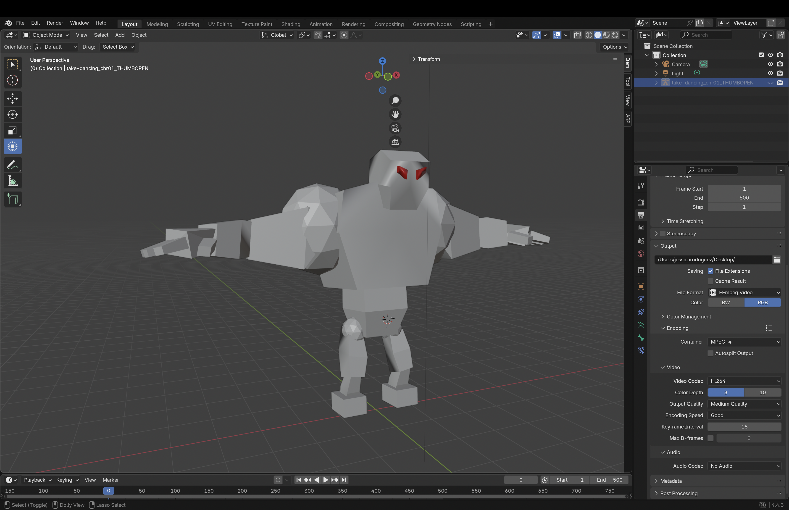
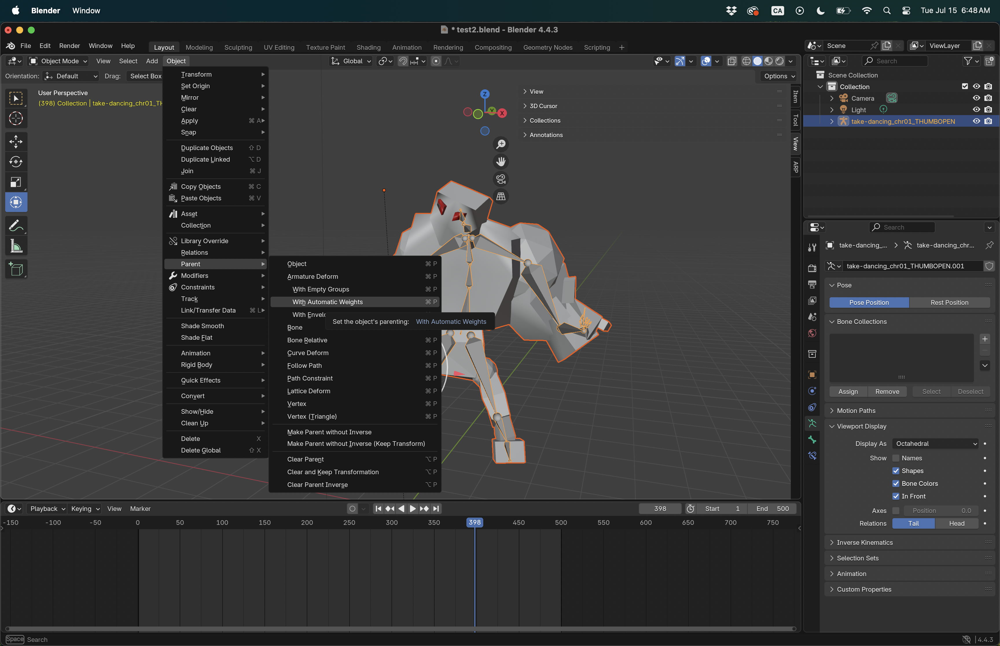
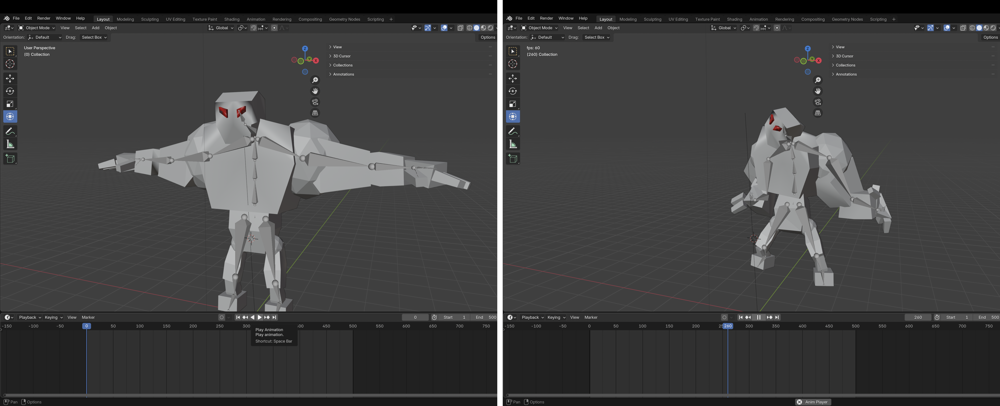

[MOCAP Tutorials](README.md) | [Home](../../README.md)

-------------------------------------------------------------------------------

# 🌀 Re-targeting Movements in Blender  
## Using Motion Capture Data from Perception Neuron 3 (.bvh)

---

### 📌 What is MOCAP and Retargeting?

**Motion Capture (MOCAP)** is a technique for recording human movement and translating it to a digital character. In this guide, we use **.bvh files** captured with Perception Neuron 3 (PN3) and apply that movement to a custom 3D model in **Blender**.

**Retargeting** refers to the process of **mapping motion data from one skeleton (e.g., a BVH armature)** onto another (e.g., your character model), allowing different rigs or body types to perform the same animation.

---

## Option 1: Manual Retargeting (No Armature on Import)

This method works best when you want to manually align BVH motion to a static mesh model without pre-existing rig constraints.

### 💡 Tips
- Avoid scaling bones in **Edit Mode** — this can break animation playback  
- Use orthographic views (`Numpad 1/3/7`) to check alignment  
- You can clean up or simplify keyframes using the **Graph Editor**

---

### Step-by-Step Instructions

First, create a new Blender project and **save the file** as `Character-with-MOCAP-1.blend`.
Then, follow these steps:

#### 1. **Import Your Character Mesh**  
   - In Blender, go to `File → Import → OBJ/FBX` (or whatever format your model is in)  
   - Make sure your model **does not include an armature**
  

#### 2. **Import Your BVH File**  
   - Go to `File → Import → Motion Capture (.bvh)`  
   - Select your `.bvh` file  
   - Before importing: In the **Transform** panel on the right, set the **Scale** to `0.1`  
   - Click **Import BVH**  
   - This will create a **BVH armature** with baked motion keyframes

#### 3. **Align BVH Scale with Character**  
   - Your mocap character may appear larger/smaller than your mesh  
   - Use **`S` (scale)** on the **BVH armature only** (Object Mode)  
   - Do **not scale the armature in Edit Mode** or using non-uniform transforms

#### 4. **Match Bone Positions**  
   - Select the **BVH armature**  
   - Enter **Edit Mode**  
   - Move and adjust bones so they **visually align with your character’s mesh**  
   - Focus on key joints like the **shoulders, hips, knees, and feet** for accurate alignment

#### 5. **Parent the Mesh**  
   - To apply the BVH armature to your mesh, select the **mesh first**, then **Shift+click the armature**  
   - Press `Ctrl+P` and choose **With Automatic Weights**  
   - **Note**: This works best if your mesh is **roughly aligned** with the armature  
   - **Tip**: Use **Weight Paint mode** to fine-tune how bones influence the mesh if deformations look incorrect

#### 6. **Play the Timeline**  
   - Press `Spacebar` or drag the timeline to preview the movement  
   - Your BVH skeleton should animate based on the captured motion
  

#### 7. **Export short video**  
   - Go to the **Output Properties** tab (printer icon in the Properties Panel).
   - Set the **frame range** to max 1-500.
   - Under **Output**, choose a location to save and set the file format to `FFmpeg video`.
   - In the **Encoding** section (appears when FFmpeg is selected):
      - Set **Container** to `MPEG-4`
      - Set **Video Codec** to `H.264`
   - Go to **Render → Render Animation** (`Ctrl + F12`).
   - Once done, your video file will be saved in the selected folder.

<iframe width="560" height="315" src="https://www.youtube.com/embed/3eJmISziyIY?si=ZCpno06akClY-OWQ" title="YouTube video player" frameborder="0" allow="accelerometer; autoplay; clipboard-write; encrypted-media; gyroscope; picture-in-picture; web-share" referrerpolicy="strict-origin-when-cross-origin" allowfullscreen></iframe>

---

## 🔄 Option 2: [Coming Soon]

This section will cover using **Rigify or other rig retargeting systems** for automated bone mapping and constraint setup.

---

